# VTEX - OCA

[Integration of carrier Oca and VTEX](https://oca-vtex-docs.vercel.app/)

## Manual Installation

Clone the repo:

```bash
git clone https://github.com/conexa-projects/OCA.VTEX-Backend.git
```

Install the dependencies:

```bash
yarn install
```

Set the environment variables:

```bash
cp .env.example .env

# open .env and modify the environment variables
```

## Table of Contents

- [Commands](#commands)
- [Docker Compose](#docker-compose)
- [Environment Variables](#environment-variables)
- [Project Structure](#project-structure)
- [Sequence Diagrams](#sequence-diagrams)
  - [Auth](#auth)
  - [Onboarding](#onboarding)
  - [Panel](#panel)
  - [Webhooks](#webhooks)
- [Error Handling](#error-handling)
- [Validation](#validation)
- [Logging](#logging)
- [Linting](#linting)
- [License](#license)

## Commands

Running locally:

```bash
yarn dev
```

Running in production:

```bash
yarn start
```

Compiling to JS from TS

```bash
yarn build
```

Commiting changes

```bash
yarn commit
```

Generating Documentation (Postman to Swagger):

```bash
yarn generate:docs
```

Testing:

```bash
# run all tests
yarn test

# run all tests in watch mode
yarn test:watch

# run test coverage
yarn coverage
```

Linting:

```bash
# run ESLint
yarn lint

# fix ESLint errors
yarn lint --fix

# run prettier
yarn prettier

# fix prettier errors
yarn prettier:fix
```

## Docker Compose

To run the project locally, you'll need the following services: **MongoDB**.
You can use the example below to create your own `docker-compose.yml` file.

> 📝 This file is **not included** in the repository. You can create it manually based on your local setup.

```yaml
version: '3.8'

services:
    mongodb:
        image: mongo:latest
        ports:
            - '27017:27017'
        volumes:
            - ./data:/data/db

    mongo-express:
        image: mongo-express
        ports:
            - '8081:8081'
        environment:
            - ME_CONFIG_MONGODB_SERVER=mongodb
        depends_on:
            - mongodb
```

## Environment Variables

The environment variables can be found and modified in the `.env` file. They come with these default values:

```bash
NODE_ENV=

PORT=
DEBUG=

CRYPTOJS_SECRET_KEY=
JWT_SECRET=

API_URL=
FRONTEND_URL=

MONGODB_URL=

# API_EMAIL #
RECIPIENT_EMAIL=
NODEMAILER_EMAIL=
NODEMAILER_PASSWORD=
NODEMAILER_SERVICE=
NODEMAILER_HOST=
NODEMAILER_PORT=

CONEXA_UTILS_API_URL=
OCA_FORCE_PROD=
```

| Environment Variable | Description | Default Value  |
| -------------------- | ----------- | -------------- |
| `PORT` | The port number of the server | `5420` |
| `NODE_ENV` | Node environment | `development` |
| `DEBUG` | Whether to enable debug mode | `true` |
| `API_URL` | The URL of the API | `http://localhost:$PORT/backvtex` |
| `FRONTEND_URL` | The URL of the frontend | `http://localhost:3000` |
| `MONGODB_URL` | The URL of the Mongo DB | `mongodb://127.0.0.1:27017/carrier-vtex`|
| `CRYPTOJS_SECRET_KEY` | The secret key for Crypto JS | `123456` |
| `JWT_SECRET` | The JWT secret | `myVerySecretString` |
| `RECIPIENT_EMAIL` | Recipient email | `milton@conexa.ai` |
| `NODEMAILER_EMAIL` | Nodemailer email | `reporteoca@gmail.com` |
| `NODEMAILER_PASSWORD` | Nodemailer password | `zwnavvgucyphufxp` |
| `NODEMAILER_SERVICE` | Nodemailer service | `gmail` |
| `NODEMAILER_HOST` | Nodemailer host | `smtp.gmail.com` |
| `NODEMAILER_PORT` | Nodemailer port | `465` |
| `CONEXA_UTILS_API_URL` | Conexa Utils API | `https://js-backend-utils.conexa.ai` |
| `OCA_FORCE_PROD` | Boolean to choose url | `false` |


## Project Structure

```
.
├── src                               # Source files
│   ├── interfaces                    # Types and interfaces
│   ├── config                        # Environment variables and other configurations
│   ├── controllers                   # Controllers
│   ├── jobs                          # Cron files
│   ├── lib                           # Utility functions
│   ├── middlewares                   # Middlewares
│   ├── models                        # Models (Mongooose)
│   ├── routes                        # Routes
│   ├── services                      # Services
│   ├── tests                         # Tests
│   ├── validations                   # Joi validations
│   ├── app.ts                        # Express App
│   ├── custom.d.ts                   # File for extending types from node modules
│   ├── declaration.d.ts              # File for declaring modules without types
│   ├── index.ts                      # App entry file
├── package.json                      # Dependencies file
├── tsconfig.json                     # Typescript config
└── README.md
```

### API Endpoints

List of available routes (base path: `/backvtex/api/v1`):

**Auth routes**:\
`GET /login` - App login\
`POST /refresh-token` - Refresh access token using a valid token.

**Onboarding routes**:\
`POST /register` - Register a new user in OCA.\
`POST /auth-vtex` - Validate VTEX credentials and webhooks subscribe\
`POST /auth-oca` - Validate OCA credentials.

`PUT /user?userId=&locationId=` - Save initial onboarding state (Package settings, Shipping settings)\
`GET /initial-state?userId=` - Retrieve initial onboarding state.

`GET /docks?userId=` - Get available docks (locations).\
`POST /docks?userId=` - Associate user with docks.

`GET /operational?userId=&locationId=` - Retrieve user operationals from OCA.\
`POST /operational?userId=&locationId=` - Save a new operational.

`GET /dispatch?userId=&locationId=` - Retrieve user dispatch.

`GET /nearby-stores?postalCode=&userId=` - Retrieve stores near a CP.\
`GET /nearby-stores-delivery?postalCode=&userId=` - Retrieve delivery-capable stores near a CP.

`POST /auth/login` - App authentication.

**Panel routes**:\
`GET /orders` - Retrieve all orders.\
`GET /order` - Retrieve a specific order.\
`PUT /order?orderId=` - Edit a specific order.\
`POST /newOrders?userId=` - Bulk order creation.\
`POST /orders/cancel?userId=` - Cancel order shipment.\
`DELETE /order/cancel?userId=` - Cancel order shipment.

`POST /orders/labels?userId=` - Generate and print shipping labels.

`GET /receipt` - Get receipt settings.\
`PUT /receipt` - Update receipt settings.

`GET /account?userId=` - Retrieve OCA account credentials.\
`PUT /account?userId=` - Update OCA account credentials.

`GET /docks?userId=` - Get available dock locations.\
`POST /docks?userId=` - Associate user with docks.

`GET /dispatch?userId=&locationId=` - Retrieve user dispatch.

`GET /operational?userId=&locationId=` - Retrieve user operationals from OCA.\
`POST /operational?userId=&locationId=` - Save a new operational.

`PUT /package?userId=` - Update package settings.

`GET /nearby-stores?postalCode=&userId=` - Retrieve stores near a CP.

**Webhook routes**:\
`POST /vtex/orders` - Order state notification from VTEX.

`POST /webhooksoca` - Webhook for OCA updates.\
`POST /oca/pickup-point` - Update OCA pickup points.\
`POST /shipping-rates` - Update OCA shipping rates.

`GET /delete-points (non-production only)` - Delete all pickup points.

### Sequence Diagrams

#### Auth

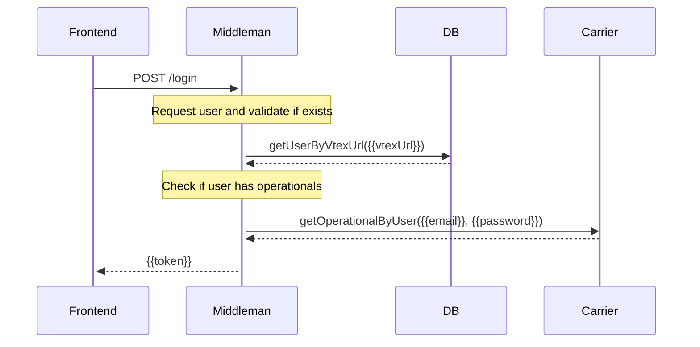

#### Onboarding

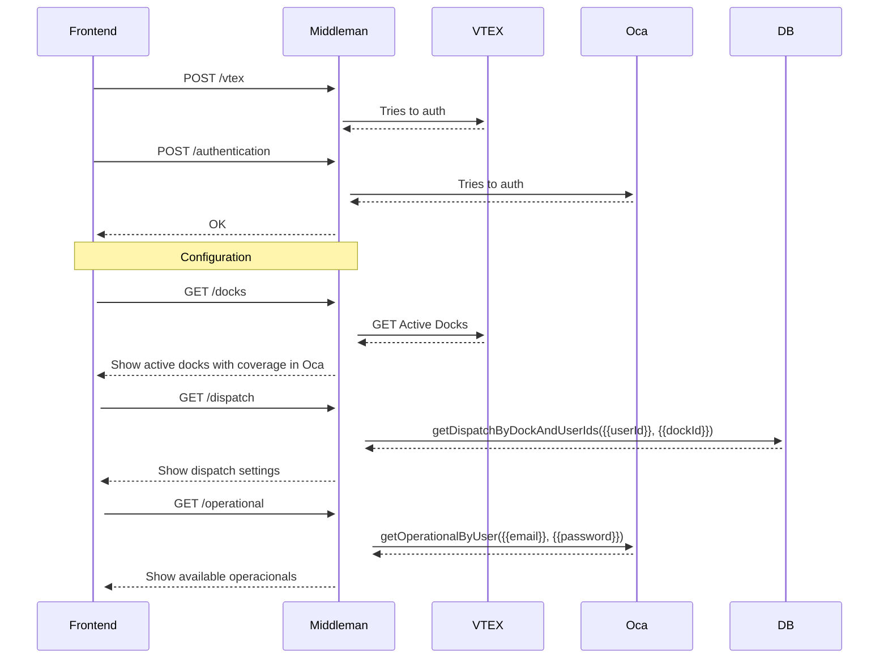

#### Panel

Get orders:

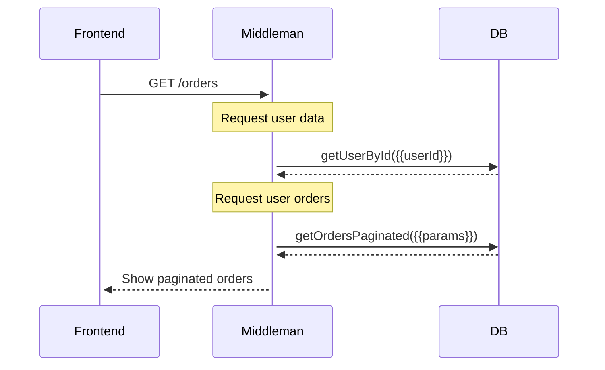

Get order:

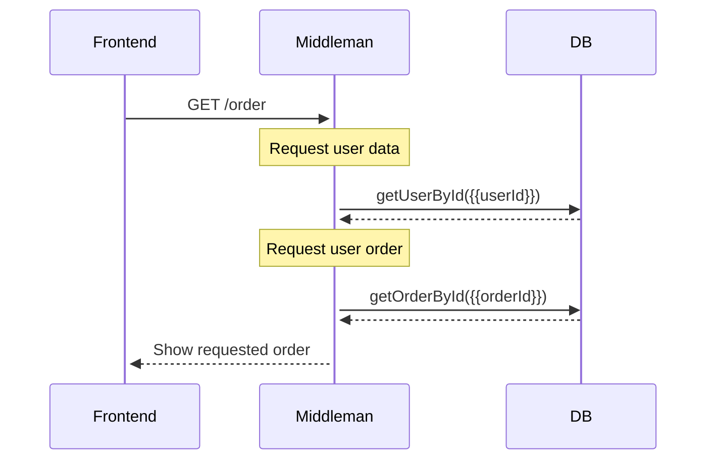

Edit order:

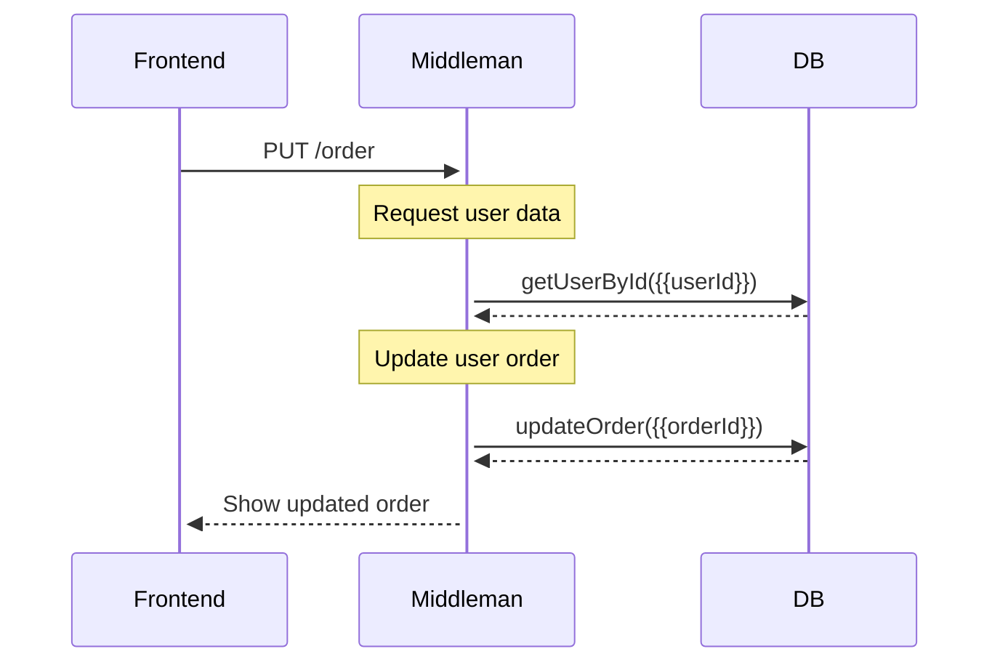

Create deliveries:

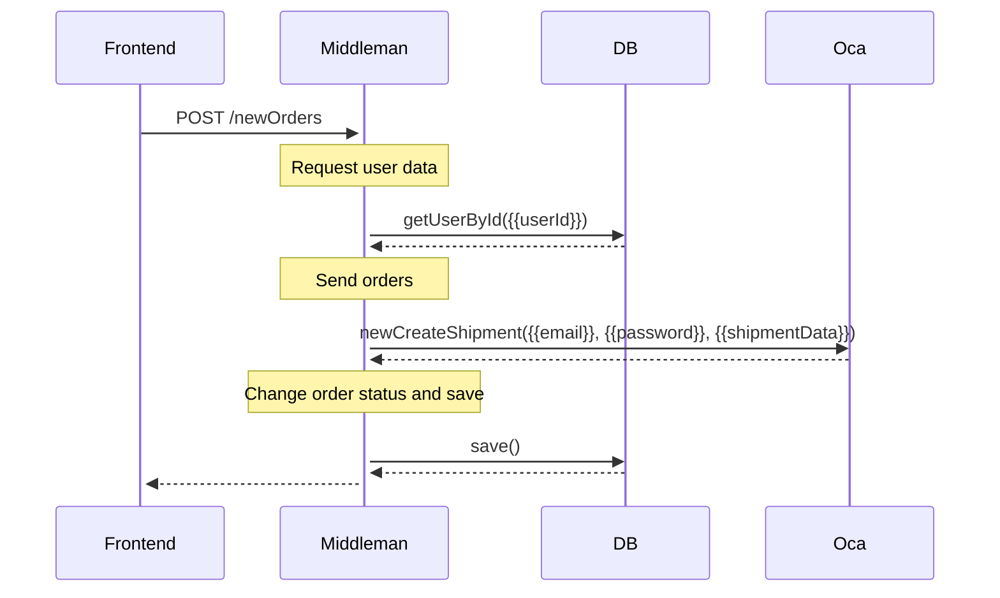

Cancel orders:

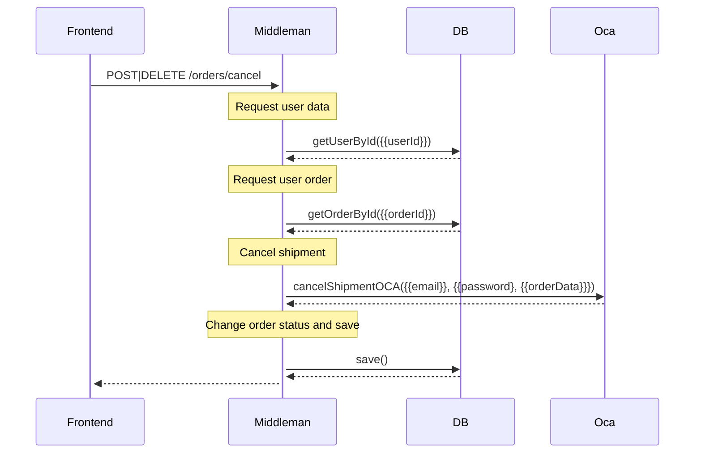

Print orders label:

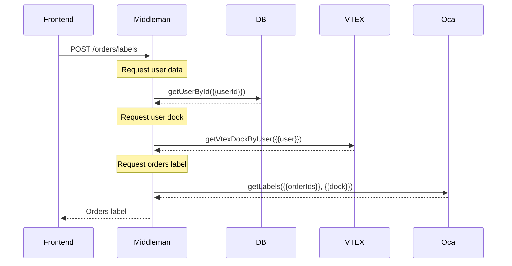

#### Webhooks

VTEX:

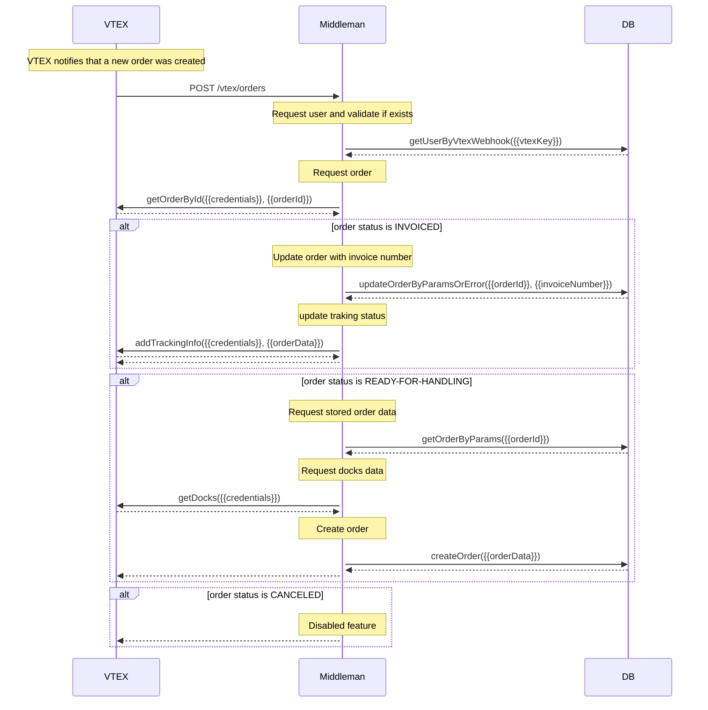

Oca:

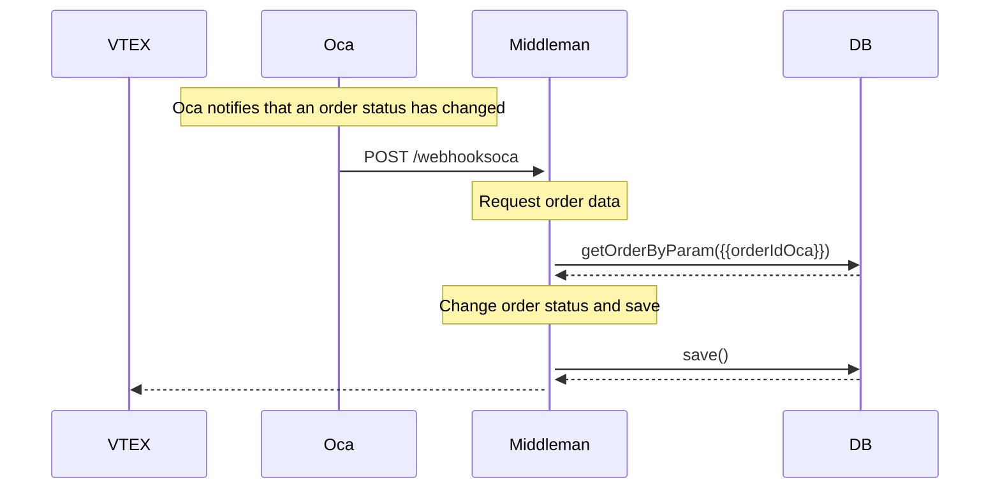

Pickup point:

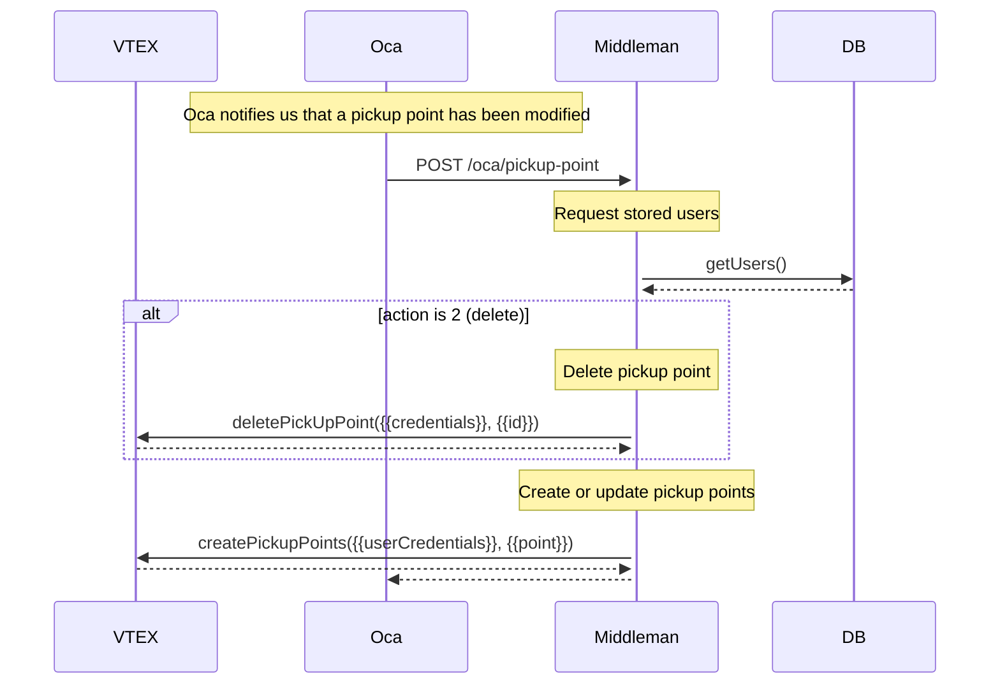

Shipping rates:

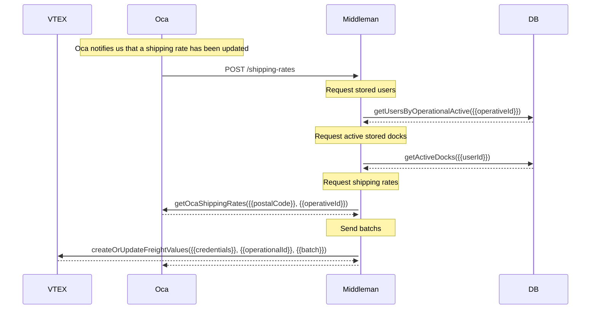

## Error Handling

The app has a centralized error handling mechanism.

Controllers should try to catch the errors and forward them to the error handling middleware (by calling `next(error)`). For convenience, you can also wrap the controller inside the catchAsync utility wrapper, which forwards the error.

```javascript
import { catchAsync } from "conexa-core-server"

const controller = catchAsync(async (req, res) => {
  // this error will be forwarded to the error handling middleware
  throw new Error('Something wrong happened');
});
```

The error handling middleware sends an error response, which has the following format:

```json
{
  "success": false,
  "statusCode": 404,
  "code": "onboarding.user-not-found",
  "message": "Not found"
}
```

## Validation

Request data is validated using [Joi](https://joi.dev/). Check the [documentation](https://joi.dev/api/) for more details on how to write Joi validation schemas.

The validation schemas are defined in the `src/validations` directory and are used in the routes by providing them as parameters to the `validate` middleware.

```javascript
import express, { Router } from 'express';
import { validateMiddleware } from 'conexa-core-server';
import validations from '../validations/onboarding.validation';
import controller from '../controllers/onboarding.controller';

const router: Router = express.Router();

router.get('/initial-state', validateMiddleware(validations.initialState), controller.getInitialState);

export default router;
```

## Logging

Import the logger from `conexa-core-server`. It is using the [Winston](https://github.com/winstonjs/winston) logging library.

Logging should be done according to the following severity levels (ascending order from most important to least important):

```javascript
import { Logger } from "conexa-core-server";

logger.error('message'); // level 0
logger.warn('message'); // level 1
logger.info('message'); // level 2
logger.http('message'); // level 3
logger.verbose('message'); // level 4
logger.debug('message'); // level 5
```

In development mode, log messages of all severity levels will be printed to the console.

In production mode, only `info`, `warn`, and `error` logs will be printed to the console.\
It is up to the server (or process manager) to actually read them from the console and store them in log files.\
This app uses pm2 in production mode, which is already configured to store the logs in log files.

Note: API request information (request url, response code, timestamp, etc.) are also automatically logged using out Http Logger found in the **conexa-core-server** package (which implements [morgan](https://github.com/expressjs/morgan)).

## Linting

Linting is done using [ESLint](https://eslint.org/) and [Prettier](https://prettier.io).

In this app, ESLint is configured to follow the [Airbnb JavaScript style guide](https://github.com/airbnb/javascript/tree/master/packages/eslint-config-airbnb-base) with some modifications. It also extends [eslint-config-prettier](https://github.com/prettier/eslint-config-prettier) to turn off all rules that are unnecessary or might conflict with Prettier.

To modify the ESLint configuration, update the `.eslintrc.json` file. To modify the Prettier configuration, update the `.prettierrc.json` file.

To prevent a certain file or directory from being linted, add it to `.eslintignore` and `.prettierignore`.

To maintain a consistent coding style across different IDEs, the project contains `.editorconfig`

## License

[CONEXA]


